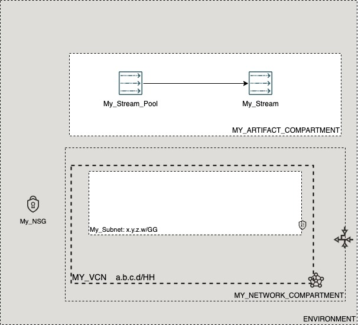

# OCI Cloud Bricks: Streaming

[](https://img.shields.io/badge/license-UPL-green) [](https://sonarcloud.io/dashboard?id=oracle-devrel_terraform-oci-cloudbricks-streams)

## Introduction
The following cloud brick enables you to create a stream associated to a stream pool inside OCI

## Reference Architecture
The following is the reference architecture associated to this brick


### Prerequisites
- Pre-existent compartment structure
- Pre-existent Streams Pool

---
## Sample tfvar file

```shell
########## SAMPLE TFVAR FILE ##########
########## PROVIDER SPECIFIC VARIABLES ##########
region           = "foo-region-1"
tenancy_ocid     = "ocid1.tenancy.oc1..abcdefg"
user_ocid        = "ocid1.user.oc1..aaaaaaabcdefg"
fingerprint      = "fo:oo:ba:ar:ba:ar"
private_key_path = "/absolute/path/to/api/key/your_api_key.pem"
########## PROVIDER SPECIFIC VARIABLES ##########
########## ARTIFACT SPECIFIC VARIABLES ##########
stream_instance_compartment_name    = "MY_ARTIFACT_COMPARTMENT"
stream_pool_display_name            = "My_Stream_Pool"
stream_display_name                 = "My_Stream"
stream_log_retention_hours          = "24"
stream_num_partitions               = "1"
########## ARTIFACT SPECIFIC VARIABLES ##########
########## SAMPLE TFVAR FILE ##########
```

### Variable specific considerations
- Stream will be created on the same compartment where the stream pool associated to it locates at
- The amount of bandwidth given by stream is a direct consecuence of the amount of partitions are passed on through variable `stream_num_partitions`

---

## Sample provider
The following is the base provider definition to be used with this module

```shell
terraform {
  required_version = ">= 0.13.5"
}
provider "oci" {
  region       = var.region
  tenancy_ocid = var.tenancy_ocid
  user_ocid        = var.user_ocid
  fingerprint      = var.fingerprint
  private_key_path = var.private_key_path
  disable_auto_retries = "true"
}

provider "oci" {
  alias        = "home"
  region       = data.oci_identity_region_subscriptions.home_region_subscriptions.region_subscriptions[0].region_name
  tenancy_ocid = var.tenancy_ocid  
  user_ocid        = var.user_ocid
  fingerprint      = var.fingerprint
  private_key_path = var.private_key_path
  disable_auto_retries = "true"
}
```
---

## Variable documentation

## Requirements

No requirements.

## Providers

| Name | Version |
|------|---------|
| <a name="provider_oci"></a> [oci](#provider\_oci) | 4.40.0 |

## Modules

No modules.

## Resources

| Name | Type |
|------|------|
| [oci_streaming_stream.Stream](https://registry.terraform.io/providers/hashicorp/oci/latest/docs/resources/streaming_stream) | resource |
| [oci_identity_compartments.COMPARTMENTS](https://registry.terraform.io/providers/hashicorp/oci/latest/docs/data-sources/identity_compartments) | data source |
| [oci_streaming_stream_pools.SPOOL](https://registry.terraform.io/providers/hashicorp/oci/latest/docs/data-sources/streaming_stream_pools) | data source |

## Inputs

| Name | Description | Type | Default | Required |
|------|-------------|------|---------|:--------:|
| <a name="input_fingerprint"></a> [fingerprint](#input\_fingerprint) | API Key Fingerprint for user\_ocid derived from public API Key imported in OCI User config | `any` | n/a | yes |
| <a name="input_private_key_path"></a> [private\_key\_path](#input\_private\_key\_path) | Private Key Absolute path location where terraform is executed | `any` | n/a | yes |
| <a name="input_region"></a> [region](#input\_region) | Target region where artifacts are going to be created | `any` | n/a | yes |
| <a name="input_stream_display_name"></a> [stream\_display\_name](#input\_stream\_display\_name) | Display Name of Created Stream | `any` | n/a | yes |
| <a name="input_stream_instance_compartment_name"></a> [stream\_instance\_compartment\_name](#input\_stream\_instance\_compartment\_name) | Compartment name where Stream is located | `string` | `""` | no |
| <a name="input_stream_log_retention_hours"></a> [stream\_log\_retention\_hours](#input\_stream\_log\_retention\_hours) | The number of hours to keep a log file before deleting it (in hours). | `string` | `"24"` | no |
| <a name="input_stream_num_partitions"></a> [stream\_num\_partitions](#input\_stream\_num\_partitions) | The default number of log partitions per topic. | `string` | `"1"` | no |
| <a name="input_stream_pool_display_name"></a> [stream\_pool\_display\_name](#input\_stream\_pool\_display\_name) | The name of the stream pool. | `any` | n/a | yes |
| <a name="input_tenancy_ocid"></a> [tenancy\_ocid](#input\_tenancy\_ocid) | OCID of tenancy | `any` | n/a | yes |
| <a name="input_user_ocid"></a> [user\_ocid](#input\_user\_ocid) | User OCID in tenancy. | `any` | n/a | yes |

## Outputs

| Name | Description |
|------|-------------|
| <a name="output_stream"></a> [stream](#output\_stream) | Stream Object |
## Contributing
This project is open source.  Please submit your contributions by forking this repository and submitting a pull request!  Oracle appreciates any contributions that are made by the open source community.

## License
Copyright (c) 2021 Oracle and/or its affiliates.

Licensed under the Universal Permissive License (UPL), Version 1.0.

See [LICENSE](LICENSE) for more details.
